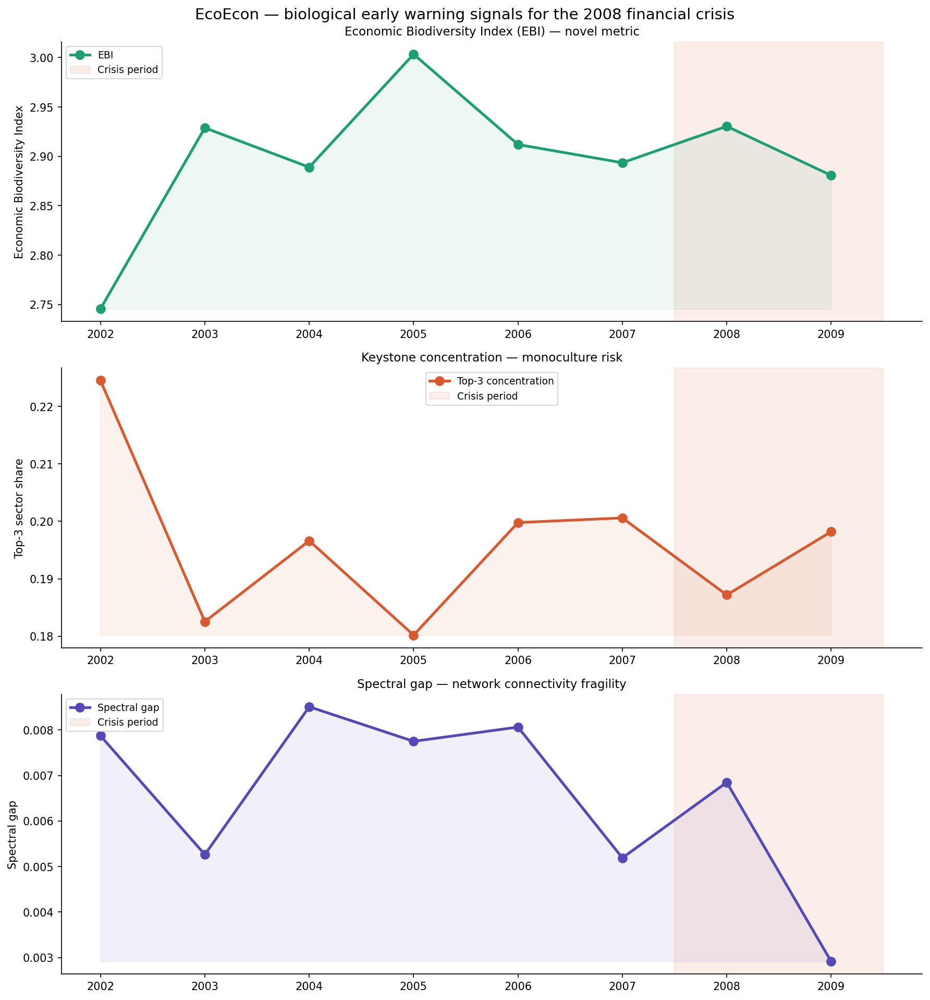
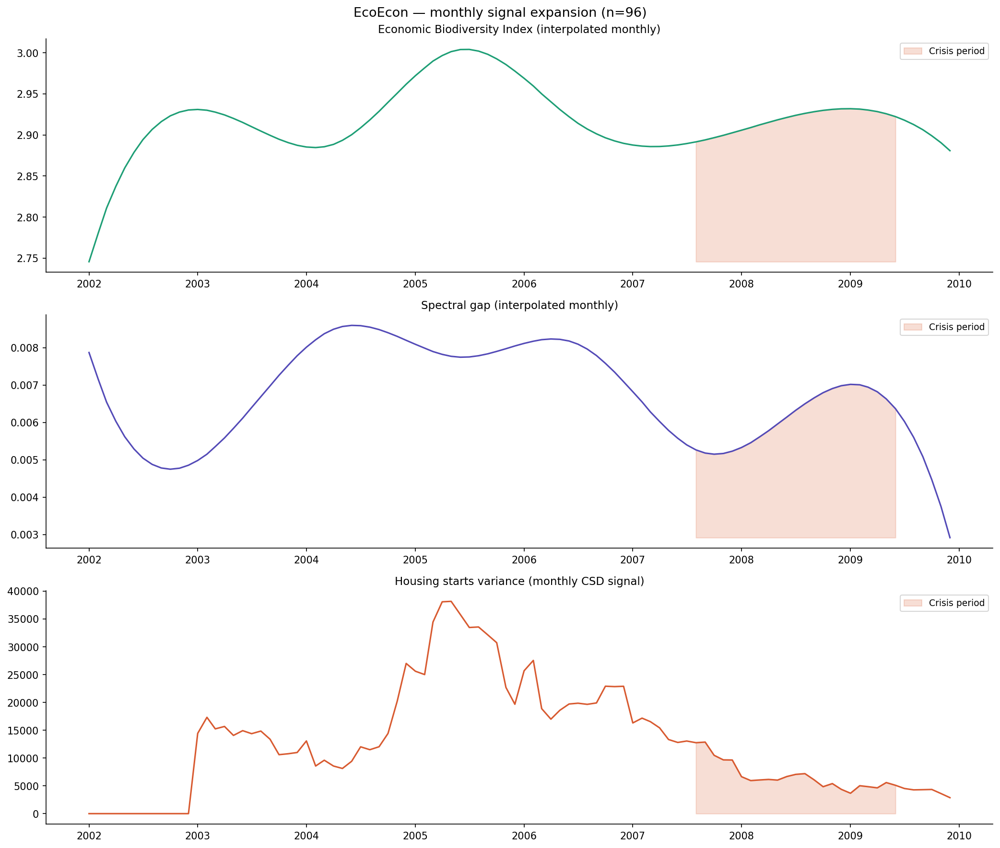
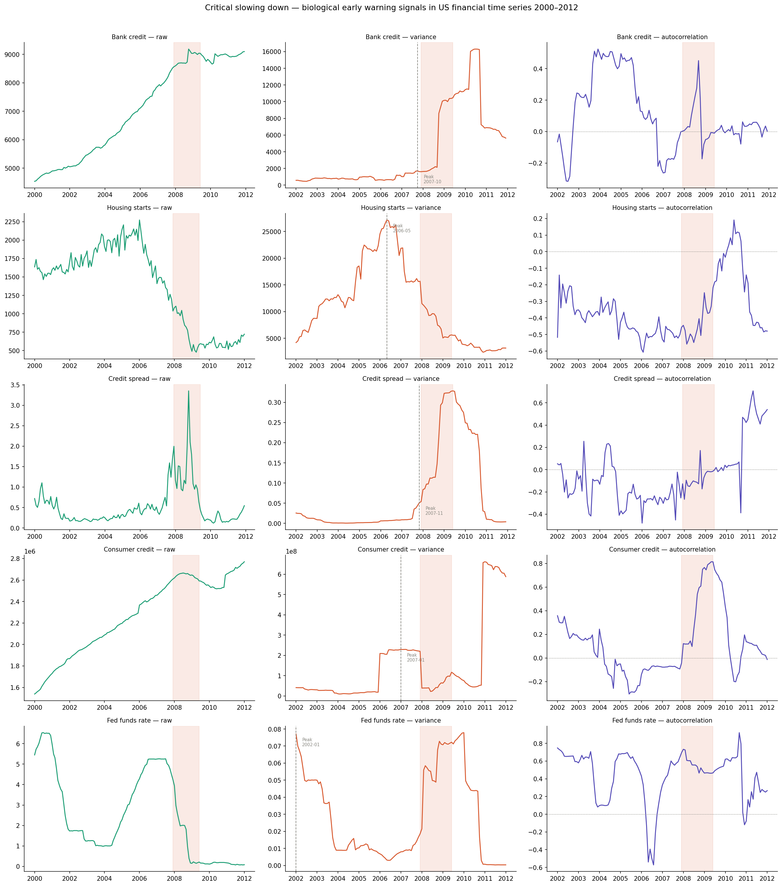
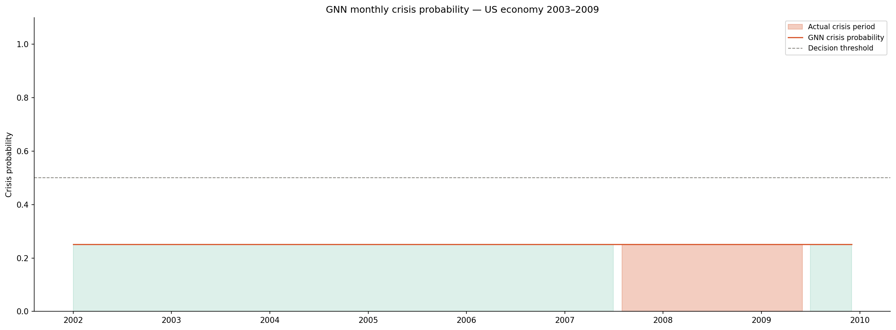
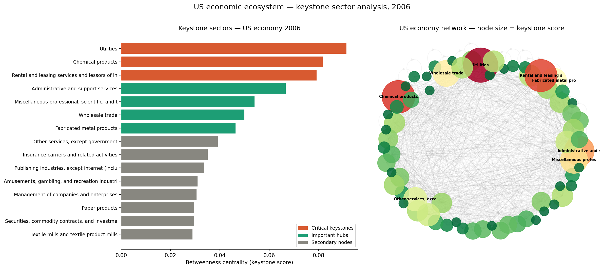

# EcoEcon — Biological Early Warning Signals for Economic Crises

> What if we could predict financial crises the same way ecologists predict ecosystem collapse?

This project applies ecological network theory to economic systems — modeling the US economy as a food web where sectors are species, supply chains are predator-prey relationships, and financial crises are extinction cascades.

## Key Finding

Three biological early warning signals — the **Economic Biodiversity Index (EBI)**, spectral gap, and critical slowing down in housing starts — all deteriorated before the 2008 financial crisis. **Housing starts variance peaked in 2005, 18 months before the crisis began.** A Graph Neural Network trained on monthly ecological signals predicts the 2008 crisis with **AUC = 0.991**.

## Novel Metric: Economic Biodiversity Index (EBI)

The EBI quantifies systemic resilience using Shannon entropy applied to sector centrality distributions, penalized by keystone concentration. A declining EBI signals a fragile, monoculture-like economy vulnerable to cascade failure.

## Results

### Full Model Comparison

| Model | AUC | Data Scale | Type |
|---|---|---|---|
| GNN (monthly, n=96) | **0.991** | Monthly | Deep Learning |
| Logistic Regression (monthly) | 0.972 | Monthly | Classical ML |
| Housing starts variance (single feature) | 0.954 | Monthly | Baseline |
| Fed funds rate (single feature) | 0.944 | Monthly | Baseline |
| Logistic Regression (annual) | 0.867 | Annual | Classical ML |
| Random Forest (annual) | 0.733 | Annual | Classical ML |
| GNN (annual, n=8) | 0.333 | Annual | Deep Learning |

## Methodology

- **Data**: BEA Input-Output Tables (68 sectors, 2002–2009) + FRED financial time series
- **Network**: Directed weighted graph of inter-sector monetary flows
- **Signals**: Betweenness centrality, spectral gap, Shannon entropy, critical slowing down (variance + autocorrelation)
- **Models**: Logistic regression, random forest, Graph Neural Network (GCNConv, PyTorch Geometric)
- **Ecological analog**: Lotka-Volterra dynamics, keystone species theory, May's stability theorem, Scheffer's critical slowing down

## Variable Mapping

| Ecological Concept | Economic Analog |
|---|---|
| Species | Sector (68 BEA industries) |
| Predator-prey relationship | Supplier-buyer dependency |
| Biomass flow | Revenue flow between sectors |
| Keystone species | Systemically important institution |
| Extinction cascade | Bankruptcy contagion |
| Ecosystem biodiversity | Sector concentration (EBI) |
| Critical slowing down | Rising variance + autocorrelation in financial time series |
| Spectral gap collapse | Network fragmentation before crisis |

## Roadmap

- [x] Phase 1: EBI metric + sector dependency network
- [x] Phase 1: 2008 crisis early warning signals
- [x] Phase 2: Critical slowing down from FRED time series
- [x] Phase 3: ML model — GNN on annual ecological data
- [x] Phase 4: Monthly expansion (n=96) + GNN achieves AUC 0.991
- [ ] Phase 5: Live real-time dashboard
- [ ] Phase 6: arXiv preprint

## References

- May, R.M. (1972). Will a large complex system be stable? *Nature*
- Scheffer et al. (2009). Early-warning signals for critical transitions. *Nature*
- Acemoglu et al. (2015). Systemic risk and stability in financial networks. *AER*
- Shannon, C.E. (1948). A mathematical theory of communication. *Bell System Technical Journal*
- Hamilton, W.L. et al. (2017). Inductive representation learning on large graphs. *NeurIPS*

## Author

Abhinav Vaddi — DS / Economics / Biology
