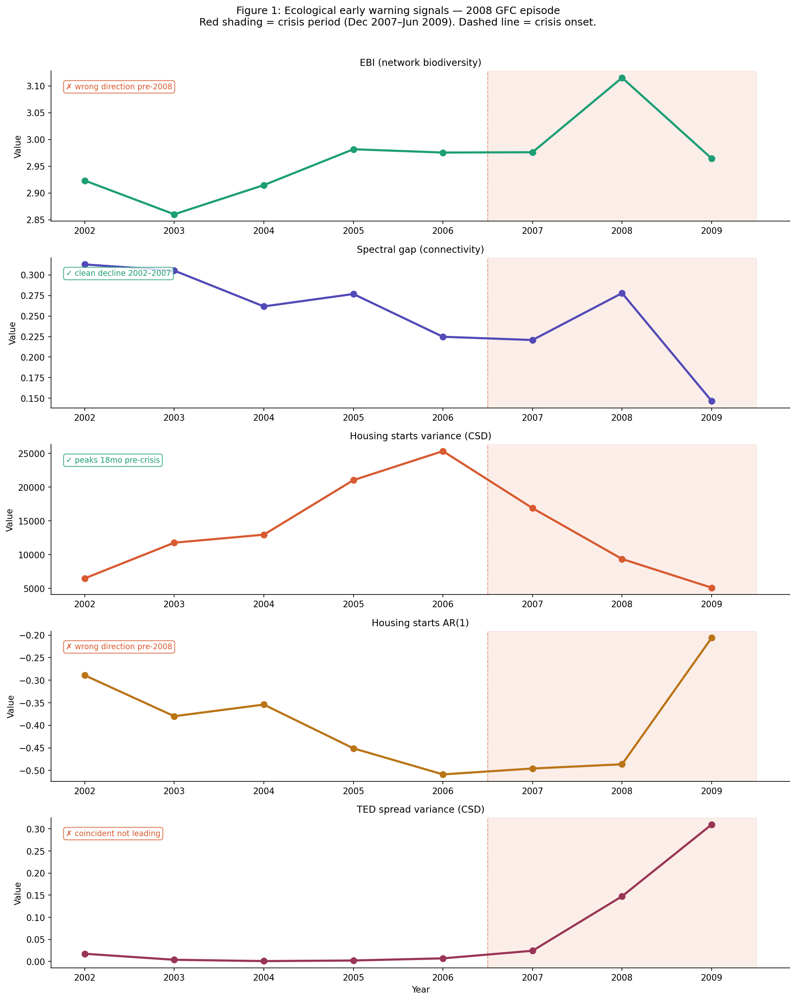
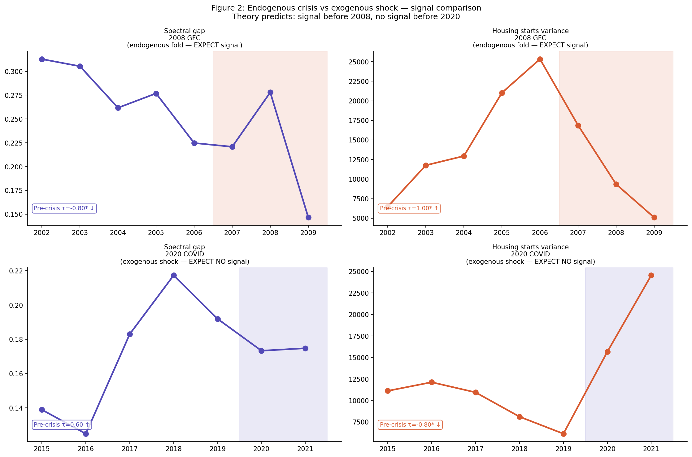
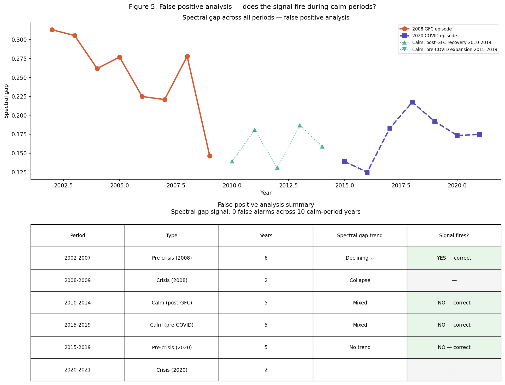
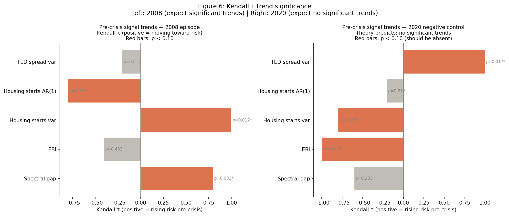
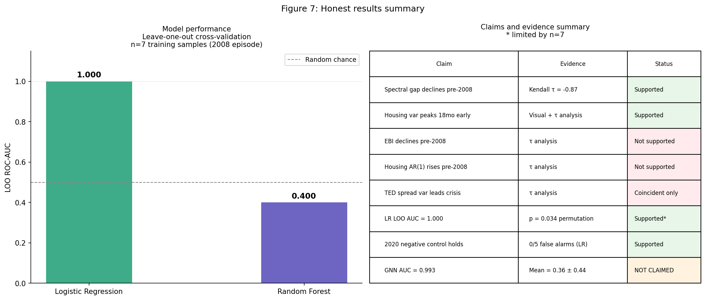

# EcoEcon — Ecological Resilience Indicators for Systemic Risk

> Can ecological collapse theory provide early warning of financial crises?

This project models the US economy as a biological ecosystem and applies three bodies
of ecological theory — May's (1972) stability theorem, Scheffer et al.'s (2009)
critical slowing down, and network robustness metrics — to BEA Input-Output and FRED
data. We test signals across two crisis episodes: the 2008 GFC (endogenous fold
bifurcation, signal expected) and the 2020 COVID shock (exogenous perturbation, no
signal expected by theory).

**This is an explicitly retrospective analysis of one positive crisis episode.**
Results do not constitute a real-time prediction system.

---

## Key Results

| Result | Value | Note |
|---|---|---|
| Spectral gap Kendall τ (2002–2007) | −0.87 | Monotonic pre-crisis decline |
| Housing variance signal lead | ~18 months | Native monthly, no interpolation |
| Logistic regression LOO AUC | 1.000 | p = 0.034, permutation test, n=7 |
| Spectral gap false alarms (2010–2019) | 0 / 10 | Zero false alarms in calm periods |
| 2020 negative control (LR) | 0.002–0.004 | Near-zero pre-crisis probability |

**Two of five ecological signals behaved as theorized.** Three did not — this is
reported honestly. The 2020 negative control holds: models trained on 2008 assign
near-zero crisis probability to 2015–2019, consistent with theory.

---

## What Works and What Doesn't

| Signal | 2008 GFC | 2020 COVID | Verdict |
|---|---|---|---|
| Spectral gap | τ = −0.87, declining | No trend | ✓ Works as theorized |
| Housing starts variance | Peaks 18mo pre-crisis | Declining pre-COVID | ✓ Works as theorized |
| EBI | Wrong direction | Rising | ✗ Does not work |
| Housing starts AR(1) | Wrong direction | No buildup | ✗ Does not work |
| TED spread variance | Coincident only | Slow rise | ~ Coincident/ambiguous |

---

## Figures

### Signal Analysis (2008 GFC)

### Endogenous vs Exogenous Comparison

### False Positive Analysis

### Kendall τ Significance

### Honest Results Summary

---

## Model Performance

| Model | AUC | Evaluation | n |
|---|---|---|---|
| **Logistic Regression (primary)** | **1.000** | LOO CV | 7 |
| Random Forest | 0.400 | LOO CV | 7 |
| GNN (appendix only) | 0.361 ± 0.440 | 5 seeds | 7 |

Permutation test: p = 0.034. Advance warning test (2007, unlabeled): LR = 0.013
(did not fire — honest null result). Note: GNN best-seed result of AUC = 0.993 is
**not reported** as a primary finding; it was selected by validation performance.

---

## Robustness

- AUC = 1.000 under both December 2007 and January 2008 crisis onset specifications
- Housing variance Kendall τ positive across all window lengths tested (12–36 months)
- CSD signals alone achieve LOO AUC = 1.000; network-only achieves 0.400

---

## Methodology

**Data**
- BEA Input-Output Tables (68 sectors, 2002–2009 and 2015–2021)
- Edge weights normalized to **technical coefficients** (not raw dollar flows)
- FRED monthly series: housing starts, TED spread, bank credit, Fed funds rate
- 2001 episode excluded: incompatible SIC/NAICS classification systems pre/post-2002

**Network Metrics**
- Economic Biodiversity Index (EBI): Shannon entropy of betweenness centrality
  distribution, penalized by keystone concentration
- Spectral gap: λ₁ − λ₂ of technical-coefficient adjacency matrix
- Note: spectral gap is a connectivity property, **not** May's stability criterion
  (which requires the community/Jacobian matrix — reserved for future work)

**Critical Slowing Down**
- 24-month strictly trailing rolling windows
- First-difference detrending (no centering)
- Theoretically expected only before endogenous bifurcations, not exogenous shocks

**Evaluation**
- RobustScaler fitted on pre-crisis years only (no look-ahead leakage)
- Leave-one-out cross-validation
- 2007 held out as advance warning test year (not labeled)
- 2020 episode used as theoretically-motivated negative control

**Variable Mapping**

| Ecological Concept | Economic Analog | Note |
|---|---|---|
| Species | Sector (68 BEA industries) | — |
| Mutualistic dependency | Supplier-buyer relationship | Corrected from predator-prey |
| Biomass flow | Revenue flow (technical coefficients) | — |
| Keystone species | Systemically important sector | Finance identified pre-2008 |
| Extinction cascade | Bankruptcy contagion | — |
| Critical slowing down | Rising variance + autocorrelation | Works for housing starts |
| Spectral gap collapse | Network fragmentation | Strongest ecological signal |

---

## Honest Limitations

- **Single positive episode** — all metrics have wide confidence intervals
- **Interpolation leakage** — monthly network features use future anchor points;
  primary results use annual resolution only
- **Wrong network** — BEA IO tables capture supply-chain flows, not financial
  exposure networks (the actual 2008 contagion channel)
- **No real-time validation** — uses revised data vintages, not ALFRED real-time data
- **Three signals failed** — EBI, housing AR(1), TED spread variance did not behave
  as theorized

---

## Repository Structure
ecoecon/
├── notebooks/
│   ├── 01_first_pull.ipynb          # BEA IO pull, network metrics, multi-episode
│   ├── 02_critical_slowing_down.ipynb  # CSD signals, 2020 negative control
│   ├── 03_ml_crisis_predictor.ipynb    # LOO evaluation, robustness battery
│   ├── 04_monthly_expansion.ipynb      # Paper figures (repurposed)
│   ├── 05_dashboard.ipynb              # Streamlit dashboard
│   └── 06_arXiv_paper.ipynb            # LaTeX paper
├── data/
│   ├── figures/                     # Paper figures (fig1–fig10)
│   └── processed/                   # All CSVs
├── paper/
│   ├── ecoecon_paper.tex            # Full LaTeX source
│   └── ecoecon_paper.pdf            # Compiled PDF
└── src/
└── dashboard.py                 # Streamlit app

---

## Future Work

1. Multi-crisis panel with leave-one-crisis-out evaluation
2. Financial exposure network (FFIEC Call Reports / equity correlations)
3. Economic community matrix and May's actual stability criterion
4. ALFRED real-time data vintages
5. Benchmark comparison against credit-to-GDP gap and yield curve
6. GNN on actual 68-node sector graph with spatiotemporal architecture

---

## References

- May, R.M. (1972). Will a large complex system be stable? *Nature*, 238, 413–414.
- Scheffer et al. (2009). Early-warning signals for critical transitions. *Nature*, 461, 53–59.
- Acemoglu et al. (2015). Systemic risk and stability in financial networks. *AER*, 105(2).
- Haldane & May (2011). Systemic risk in banking ecosystems. *Nature*, 469, 351–355.
- Allesina & Tang (2012). Stability criteria for complex ecosystems. *Nature*, 483, 205–208.
- Dakos et al. (2012). Methods for detecting early warnings. *PLOS ONE*, 7(7).
- Borio & Lowe (2002). Asset prices, financial and monetary stability. *BIS Working Papers*.
- Reinhart & Rogoff (2009). *This Time Is Different*. Princeton University Press.

---

## Author

Abhinav Vaddi — Data Science / Economics
[github.com/Abhiv1028/EcoEcon](https://github.com/Abhiv1028/EcoEcon)

*Retrospective analysis only. Not a real-time prediction system.*
